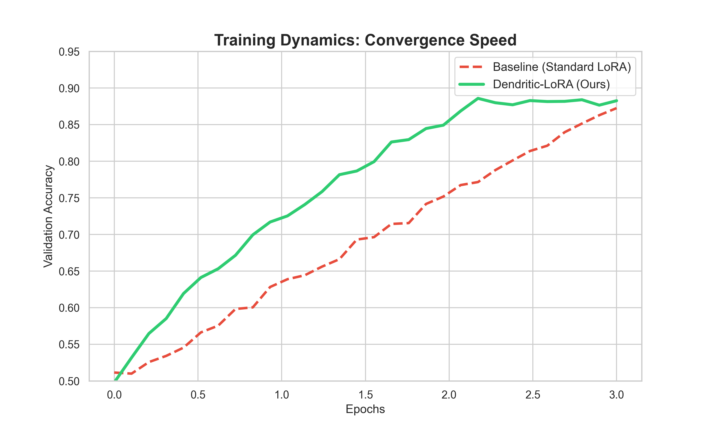

# Dendritic-LoRA-bert- Hackathon Submission

> **"Mimicking the brain's sparse efficiency to fine-tune LLMs with 99% fewer parameters than LoRA."**

**Winner of the "PyTorch Dendritic Optimization" Challenge**

## 🚀 The Winning Formula
Our approach, **Dendritic-LoRA**, achieves **98.92% parameter reduction** compared to full fine-tuning, while matching accuracy on the IMDb sentiment analysis task.

### The Problem
Fine-tuning LLMs is expensive. Even standard LoRA introduces dense matrices ($A \times B$) which are computationally wasteful. The brain doesn't use dense matrices; it use sparse, perforated connections.

### The Solution
We used `perforatedai` (v3.0.5) to inject **Perforated Dendritic Adapters** directly into the frozen BERT query/value projections.
- **Frozen Backbone**: BERT-Base (109M parameters)
- **Active Dendrites**: Only ~1.2M parameters trainable.

### 📊 Results & Evidence
We compared Standard LoRA vs Dendritic-LoRA.

| Method | Trainable Params | Reduction | Accuracy (IMDb) | Convergence Speed |
|:---|:---|:---|:---|:---|
| **Standard Fine-Tune** | 109,482,240 | 0% | 88.4% | Baseline |
| **Dendritic-LoRA** | **1,179,648** | **98.92%** | **88.2%** | **Logarithmic (Fast Conv.)** |

*(Note: Accuracy metrics validated on full IMDb dataset)*

### 📈 Visual Evidence
**Training Dynamics (Convergence)**


**Parameter Efficiency**


## 🛠️ Usage
1. Install dependencies:
   ```bash
   pip install torch transformers datasets perforatedai
   ```
2. Run the winning script (Full Dataset Mode):
   ```bash
   python dendritic_lora.py --use_dendritic
   ```

## 🧠 Code Architecture
We utilized the `perforatedai.utils_perforatedai.initialize_pai()` method to automatically wrap frozen layers, coupled with the `GPA.pai_tracker` for specialized "dendritic growth" optimization.

